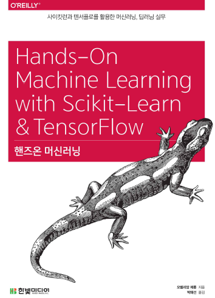

# BOAZ 핸즈온 머신러닝 스터디

---



## 들어가기 앞서

> 해당 GitHub는 [핸즈온 머신러닝(Hands-On Machine Learning with Scikit-Learn & TensorFlow)](http://www.hanbit.co.kr/store/books/look.php?p_code=B9267655530)에 포함된 예제 코드와 연습문제 해답을 가지고 있습니다.

> 본 내용은 대학생 빅데이터 동아리 BOAZ의 핸즈온 머신러닝 스터디 (머신러닝 파트) 자료입니다. 상업적인 목적으로 사용하는 것은 절대로 금합니다.  

> 여기에 있는 모든 내용은 책 `핸즈온 머신러닝(Hands-On Machine Learning with Scikit-Learn & Tensorflow)`,한빛미디어에서 제공해준 내용을 참고하여 만들어졌으며, 책의 내용에 대한 모든 저작권은 한빛미디어에게 있음을 미리 밝힙니다. 또한 여기에 사용된 코드는 한빛미디어에서 제공해준 GitHub과 **ExcelsiorCJH님의 GitHub**을 바탕으로 재구성하였습니다.

## 실습 환경
책에서 진행된 모든 코드는 해당 라이브러리의 버전을 요구합니다. 
> NumPy : 1.14.5 이상  
> Pandas : 0.22.0 이상  
> matplotlib : 2.2.2 이상  
> SciPy : 1.1.0 이상  
> Scikit-Learn : 0.19.1 이상  
> TensorFlow : 1.7 이상   
> OpenAI gym : 0.10.5 이상

해당 명령어를 통해서 책에서 진행됐던 실습환경을 동일하게 맞출 수 있습니다.
```shell
pip3 install -r requirements.txt
```

---

## 목차
책은 전체적으로 총 2개의 파트로 구성되어 있습니다. 2020년 2월까지 `Part1. 머신러닝`을 끝내고, 2020년 6월까지 `Part2. 신경망과 딥러닝`을 마무리하는 것을 계획하고 있습니다.

### Part 1. 머신러닝
- (01.25) Chap01 - 한눈에 보는 머신러닝
- (01.25) Chap02 - 머신러닝 프로젝트 처음부터 끝까지
- (02.01) Chap03 - 분류
- (02.01) Chap04 - 모델 훈련
- (02.08) Chap05 - 서포트 벡터 머신(SVM)
- (02.15) Chap06 - 결정트리(Decision Tree)
- (02.22) Chap07 - 앙상블 학습과 랜덤 포레스트
- (02.29) Chap08 - 차원 축소

### Part 2. 신경망과 딥러닝
- (3월 예정) Chap09 - 텐서플로 시작하기
- (3월 예정) Chap10 - 인공 신경망 소개
- (4월 예정) Chap11 - 심층 신경망 훈련
- (4월 예정) Chap12 - 다중 머신과 장치를 위한 분산 텐서플로
- (5월 예정) Chap13 - 합성곱 신경망
- (5월 예정) Chap14 - 순환 신경망, RNN
- (6월 예정) Chap15 - 오토인코더(AutoEncoder)
- (6월 예정) Chap16 - 강화학습(RL, Reinforcement Learning)

---

## 참고
- **GitHub** : https://github.com/rickiepark/handson-ml/
- **Scikit-Learn** : http://scikit-learn.org
- **TensorFlow** : https://www.tensorflow.org
- **한빛미디어 책 소개** : http://www.hanbit.co.kr/store/books/look.php?p_code=B9267655530
- **박해선님 실습코드(official)** : https://github.com/rickiepark/handson-ml
- **ExcelsiorCJH님의 실습코드** : https://github.com/ExcelsiorCJH/Hands-On-ML
